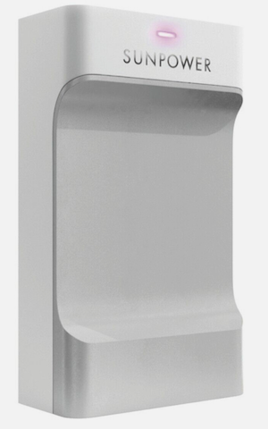
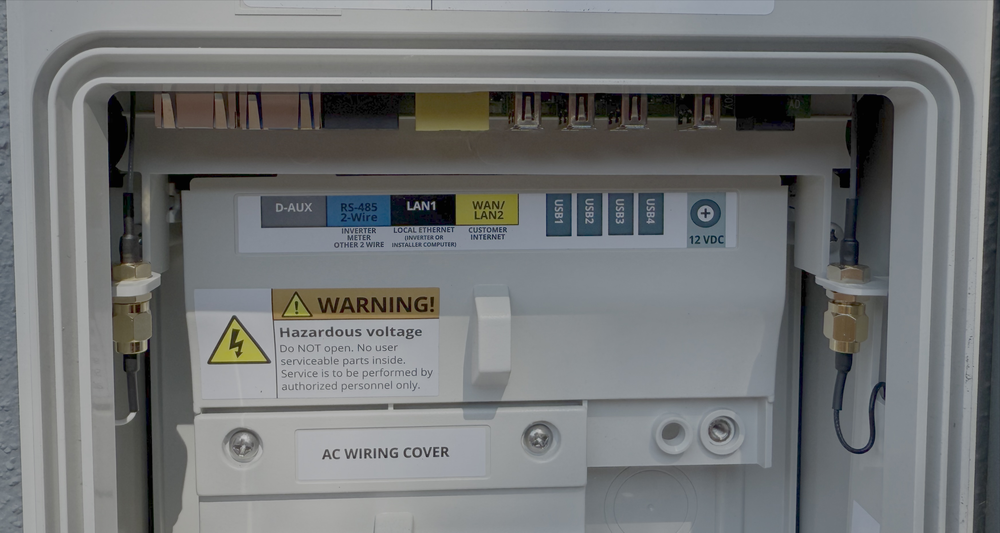
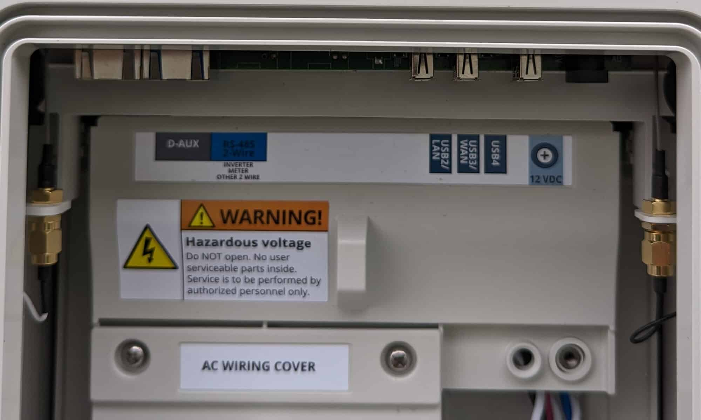

Connecting to Your PVS6 Device
==============================

This guide covers how to establish a direct network connection to your SunPower PVS6 device
for local monitoring and control. There are two main types of PVS6 devices with different
connection methods.  If you're using a PVS6 device with a USB Ethernet adapter, you'll need to
use the USB Ethernet adapter to connect to the device.  If you're using a PVS6 device with a
dedicated Ethernet port, you'll need to use the Ethernet port to connect to the device.

Identifying Your Device Type
----------------------------

Go to where your solar subpanel is installed.  Look for a device that looks like this:

Open up your PVS6 device from the front by removing the removable cover and look
at the ports along the top of the inside of the device.

If you see this:

- Has an RJ45 Ethernet port labeled "LAN1 (Installer)"
- Has multiple USB ports for different purposes

You have an older PVS6 device with a dedicated Ethernet port.  You will just need to use a standard CAT5e or CAT6 Ethernet cable to connect to the device on LAN1.

If you see this:

- Only USB ports are visible
- No dedicated Ethernet port for the installer

You have a newer PVS6 device with only USB ports.  You will need to use a USB Ethernet adapter and a standard CAT5e or CAT6 Ethernet cable to connect to the device.

Connection Methods
------------------

Direct Ethernet Connection (Older Models)
~~~~~~~~~~~~~~~~~~~~~~~~~~~~~~~~~~~~~~~~~

For PVS6 devices with dedicated Ethernet ports:

**Required Equipment**

- Standard Ethernet cable (Cat5e or Cat6)
- Computer with Ethernet port, or a USB Ethernet adapter
- Network configuration knowledge

**Connection Steps**

- Connect one end of the Ethernet cable to the PVS6 "LAN1 (Installer)" Ethernet port.
- Other end to your computer's Ethernet port or USB Ethernet adapter

USB Ethernet Adapter (Newer Models)
~~~~~~~~~~~~~~~~~~~~~~~~~~~~~~~~~~~

For PVS6 devices with only USB ports:

**Required Equipment**
- USB 2.0 to Ethernet adapter (compatible with PVS6).  The USB 3.0 tend not to work according to the community.
- Standard Ethernet cable (Cat5e or Cat6)
- Computer with Ethernet port or a USB Ethernet adapter
- Network configuration knowledge

**Recommended USB Ethernet Adapters**

These are the adapters that the community has reported working.

- `USB 2.0 to ethernet Adapter USB to RJ45 Supporting 10/100 Mbps Ethernet Network for Window/Mac OS, Surface Pro/Linux/Chromebook/Android/iOS <https://www.amazon.com/dp/B084MCVVP9>`_.
- `Cable Matters USB 2.0 → Gigabit Ethernet Adapter (Model 202023) [ASIX AX88772 chipset] <https://www.amazon.com/Cable-Matters-Ethernet-Adapter-Supporting/dp/B00ET4KHJ2>`_
- `Plugable USB2-E100 [ASIX AX88772 chipset] <https://www.amazon.com/Plugable-Ethernet-Network-Compatible-Chromebook/dp/B00484IEJS>`_

Possibly any ASIX AX88772 will work, although the first one is the cheapest and most widely available.

**Connection Steps**

- Plug the USB Ethernet adapter into one of the PVS6 USB ports.
- Connect one end of the Ethernet cable that USB Ethernet adapter.
- Other end to your computer's Ethernet port or USB Ethernet adapter

Configure your computer's Network
---------------------------------

Once you're all wired in, you'll need to configure networking.  Luckily this is
easy since the PVS6 runs a DHCP server that will configure your network settings
for you.  One thing to note is that the PVS6 runs its own nameserver to serve the
domain ``sunpowerconsole.com`` and the IP address of the PVS6 is ``172.27.153.1``.

**PVS6 Network Settings**

This is what you should get if you're using the PVS6's DHCP server.

- PVS6 IP Address: ``172.27.153.1``
- Subnet: ``172.27.153.0/24``
- Gateway: ``172.27.153.1``
- Nameserver: ``172.27.153.1``
- Your IP Address: ``172.27.153.X``, where X is a number between 2 and 254.

OS Specific Instructions
~~~~~~~~~~~~~~~~~~~~~~~~~

- On a Mac, move the ethernet device to the top of the list in the network list so that the nameserver running on the PVS6 is used first before the default nameserver.
- On Linux, add ``nameserver 172.27.153.1`` to ``/etc/resolv.conf`` as the first nameserver.  This is the IP address of the PVS6 nameserver and webserver.
- Not sure at this point if you need to do anything special for Windows.

Test Connectivity
-----------------

As said above, you should get an address assigned via DHCP from the PVS6.  You
can test this by telneting to port 443 of the PVS6's IP address: 172.27.153.1

.. code-block:: bash

   telnet 172.27.153.1 443
   Trying 172.27.153.1...
   Connected to 172.27.153.1.
   Escape character is '^]'.

You should also be able to resolve the domain ``sunpowerconsole.com`` to the PVS6's IP address.

.. code-block:: bash

   nslookup sunpowerconsole.com

   Server: 172.27.153.1
   Address: 172.27.153.1

   Name: sunpowerconsole.com
   Address: 172.27.153.1

You should be able to access the PVS6's web interface at ``https://sunpowerconsole.com``.

.. code-block:: bash

   telnet sunpowerconsole.com 443
   Trying 172.27.153.1...
   Connected to sunpowerconsole.com.
   Escape character is '^]'.
   GET / HTTP/1.1
   Host: sunpowerconsole.com
   Connection: close
   HTTP/1.1 403 Forbidden

The response should be a 403 Forbidden error.  This is expected, as SunStrong
(or SunPower?) has blocked access to the web interface from outside the PVS6's
local network.  Luckily only ``/`` is blocked, so you can still access the API.

Finally, try using the ``sungazer`` command line tool to access the API.  I'm
assuming here that you've installed the ``sungazer`` package.

.. code-block:: bash

   >>> sungazer session start
   {
      "result":	"succeed",
      "supervisor":	{
         "SWVER":	"2025.06, Build 61839",
         "SERIAL":	"ZT212345123459A0621",
         "MODEL":	"PVS6",
         "BUILD":	61839,
         "FWVER":	"1.0.0",
         "SCVER":	1630652920,
         "EASICVER":	131329,
         "SCBUILD":	1188,
         "WNSERIAL":	16,
         "WNMODEL":	400,
         "WNVER":	3000
      }
   }

This should see the PVS6's supervisor information.  It just tells you a few
interesting things about the PVS6.  You won't use in monitoring, but if you can
get this far, you've successfully connected to your PVS6.

Troubleshooting
---------------

Connection Issues
~~~~~~~~~~~~~~~~~

**No Response from Device**

- Check Ethernet cable connections
- Verify USB adapter is properly seated (newer models)
- Try different USB port (newer models)
- Try rebooting the PVS6 device by opening the circuit breaker for the PVS6 (should be in the subpanel below the PVS6), waiting 10 seconds, and then reconnecting the circuit breaker, then wait 2-3 minutes for device initialization.  You'll know it's up and running when the light on the device is solid dark green.

**403 Forbidden from the API endpoint or sungazer**

- Try rebooting the PVS6 device by opening the circuit breaker for the PVS6 (should be in the subpanel below the PVS6), waiting 10 seconds, and then reconnecting the circuit breaker, then wait 2-3 minutes for device initialization.  You'll know it's up and running when the light on the device is solid dark green.  The community has reported that this fixes the issue.

**Cannot telnet to port 443**

- Verify network configuration
- Check firewall settings
- Try different IP addresses (some devices use `192.168.0.1`)
- Restart PVS6 device as above

Getting Help
------------

If you encounter issues:

1. **Check device documentation** for specific instructions
2. **Verify hardware compatibility** for USB adapters
3. **Test with different equipment** if possible
4. **Check community forums** for similar problems

Remember that direct connection is the only way to get to the monitoring interface of your PVS6 device.